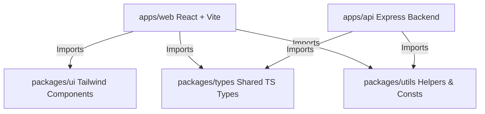

# EmpowerRural Monorepo

> **Tagline:** *"Connecting Rural Youth in India with Skills, Careers, and Opportunities."*

EmpowerRural is a production-quality, impact-driven platform designed to reduce unemployment among rural youth in India. It aggregates verified local jobs, government-certified courses, smart scheme eligibility checkers, resume builders, and AI-powered career coaching, tailored specifically for regional contexts.

---

## 🏗️ Monorepo Architecture & Structure

This repository is organized as a monorepo utilizing npm workspaces to share types, utilities, and UI components seamlessly between the client and server.



### Directory Layout

*   **[package.json](file:///c:/Users/prane/OneDrive/Desktop/CSP/package.json)** — Workspace definitions and root scripts.
*   **`apps/`**
    *   **[apps/web](file:///c:/Users/prane/OneDrive/Desktop/CSP/apps/web)** — React + TypeScript + Vite + Tailwind + PWA frontend client.
    *   **[apps/api](file:///c:/Users/prane/OneDrive/Desktop/CSP/apps/api)** — Express + Node.js + TS backend API server.
*   **`packages/`**
    *   **[packages/types](file:///c:/Users/prane/OneDrive/Desktop/CSP/packages/types/index.ts)** — Shared TypeScript interface declarations.
    *   **[packages/utils](file:///c:/Users/prane/OneDrive/Desktop/CSP/packages/utils/index.ts)** — Regional constants, formatting utilities, and localized tools.
    *   **[packages/ui](file:///c:/Users/prane/OneDrive/Desktop/CSP/packages/ui/index.ts)** — Shared Tailwind CSS atomic component library.
*   **`supabase/`**
    *   **[supabase/schema.sql](file:///c:/Users/prane/OneDrive/Desktop/CSP/supabase/schema.sql)** — PostgreSQL database schema design.
    *   **[supabase/seed.sql](file:///c:/Users/prane/OneDrive/Desktop/CSP/supabase/seed.sql)** — Initial database seed data.

---

## ✨ Features & Module Details

EmpowerRural provides a rich set of specialized features tailored to bridge the digital and career divide in rural India:

### 1. 📊 Youth Dashboard
*   **Path:** [Dashboard.tsx](file:///c:/Users/prane/OneDrive/Desktop/CSP/apps/web/src/pages/Dashboard.tsx)
*   **Description:** A personalized user hub showing profile verification status (Aadhaar linked status), a circular progress tracker, active courses, applied jobs, bookmarks, and a contextual recommendation feed.

### 2. 🔍 Government Schemes Eligibility Checker
*   **Path:** [GovSchemes.tsx](file:///c:/Users/prane/OneDrive/Desktop/CSP/apps/web/src/pages/GovSchemes.tsx)
*   **Description:** Allows youth to search, filter (Central vs. State schemes), and check eligibility. Users input details (Age, Annual Income, Qualification, State) to see matching schemes like PMKVY, DDU-GKY, and Rythu Bandhu.

### 3. 💼 Local & Remote Jobs Portal
*   **Path:** [JobsPortal.tsx](file:///c:/Users/prane/OneDrive/Desktop/CSP/apps/web/src/pages/JobsPortal.tsx)
*   **Description:** Job aggregation engine supporting filtering by Location Type (On-Site, Remote), State, District, Sector (Government vs. Private), and Minimum Qualification. Includes a mock application flow that updates dashboard statuses dynamically.

### 4. 🎓 Skill Development & Assessment Hub
*   **Path:** [SkillDevelopment.tsx](file:///c:/Users/prane/OneDrive/Desktop/CSP/apps/web/src/pages/SkillDevelopment.tsx)
*   **Description:** Access free certified courses from SWAYAM, PMKVY, and Skill India. Features an interactive **Vocation Alignment Quiz** that evaluates user interests and maps them to career tracks (Engineering, Teaching, Agriculture, Government, Skill-Based).

### 5. 📝 visual Resume Builder
*   **Path:** [ResumeBuilder.tsx](file:///c:/Users/prane/OneDrive/Desktop/CSP/apps/web/src/pages/ResumeBuilder.tsx)
*   **Description:** Visual, easy-to-use resume generator built for rural candidates. Provides inline context-sensitive helper tips, section-by-section inputs (Education, Skills, Projects, Experience), and prints/exports directly to clean, standard single-column PDF templates.

### 6. 🗺️ Career Path Roadmaps
*   **Path:** [CareerRoadmaps.tsx](file:///c:/Users/prane/OneDrive/Desktop/CSP/apps/web/src/pages/CareerRoadmaps.tsx)
*   **Description:** Step-by-step career path guides for key local opportunities (e.g., Data Entry Operator, Remote Support Assistant, Solar Panel Installer, Organic Farming Consultant). Displays path timeline, expected salaries, required skill checks, and direct course recommendations.

### 7. 🤖 Gita: AI Career Coach
*   **Path:** [AIAssistant.tsx](file:///c:/Users/prane/OneDrive/Desktop/CSP/apps/web/src/pages/AIAssistant.tsx) | [modules/ai/index.ts](file:///c:/Users/prane/OneDrive/Desktop/CSP/apps/api/src/modules/ai/index.ts)
*   **Description:** A chat companion facilitating voice-to-text queries (using the Web Speech API) and context-aware guidance. Gita functions in multiple modes (Career Mentor, Resume Analyst, Interview Coach, Scheme Advisor) using the Gemini API.

### 8. 🎯 Interactive Interview Prep
*   **Path:** [InterviewPrep.tsx](file:///c:/Users/prane/OneDrive/Desktop/CSP/apps/web/src/pages/InterviewPrep.tsx)
*   **Description:** Simulates HR and Technical mock interviews. Users choose their track, answer verbal/text questions, and receive detailed scoring (out of 10) with structured, actionable constructive feedback on grammar, confidence, and context.

### 9. 📱 Digital Literacy Academy
*   **Path:** [DigitalLiteracy.tsx](file:///c:/Users/prane/OneDrive/Desktop/CSP/apps/web/src/pages/DigitalLiteracy.tsx)
*   **Description:** Micro-learning units teaching critical online survival skills (Mobile Banking, UPI usage, Online Safety, Basic Computing). Includes active check-your-understanding quizzes and generates a dynamic SVG Certificate of Completion.

---

## ⚡ Tech Stack

*   **Frontend Client:** React 18, TypeScript, Vite, Tailwind CSS, Framer Motion, React Router v6, TanStack Query (React Query), Lucide Icons.
*   **Backend Server:** Node.js, Express, tsx watch execution.
*   **Database:** Supabase PostgreSQL / Supabase Auth.
*   **Security & Validation:** Helmet, Express Rate Limiter, Zod validator, CORS protection.
*   **AI Integration:** Google Gemini API (fallback to local semantic rule-engine).

---

## 🔌 Dual-Mode Configuration (Live vs. Offline Mock)

EmpowerRural is engineered with a **dual-mode database & AI fallback system**. You can run the application completely offline without database keys or API tokens:

1.  **Offline Mock Mode (Default):**
    If `SUPABASE_URL` is empty or unset in your `.env`, the API launches an active in-memory database ([database/index.ts](file:///c:/Users/prane/OneDrive/Desktop/CSP/apps/api/src/database/index.ts)) seeded with sample states, districts, skills, quiz questions, jobs, and schemes. Profiles, applications, and results persist in-memory during server runtime.
2.  **Live Database Mode:**
    Provide `SUPABASE_URL` and `SUPABASE_ANON_KEY` to connect the backend to your live Supabase database tables.
3.  **AI Engine Mode:**
    If `GEMINI_API_KEY` is provided, Gita uses Google Gemini models for context-specific career/resume advice. Otherwise, it falls back to a high-fidelity local semantic rules engine that reviews keywords and scores answers.

---

## 🚀 Getting Started

### Prerequisites

Ensure you have [Node.js](https://nodejs.org/) (v20+ recommended) and npm installed.

### Setup Instructions

1.  **Install Dependencies:**
    Run the following command at the monorepo root to link packages and install dependencies:
    ```bash
    npm install --legacy-peer-deps
    ```

2.  **Configure Environment Variables:**
    Create a `.env` file at the root of the workspace. Use `.env.example` as a template:
    ```bash
    copy .env.example .env
    ```

3.  **Configure Variables:**
    Open the newly created `.env` file and configure it as desired. Leaving keys blank forces Mock Mode.

---

## 💻 Developer Scripts

Run these commands from the root directory:

*   **Start dev servers concurrently (Both Web and API):**
    ```bash
    npm run dev
    ```
    *   Frontend runs at: `http://localhost:3000`
    *   Backend API runs at: `http://localhost:5000`
    *   API Health-check: `http://localhost:5000/health`

*   **Start Backend API only:**
    ```bash
    npm run dev:api
    ```

*   **Start Frontend Web only:**
    ```bash
    npm run dev:web
    ```

*   **Build the entire workspace for production:**
    ```bash
    npm run build
    ```

*   **Lint the workspace:**
    ```bash
    npm run lint
    ```
