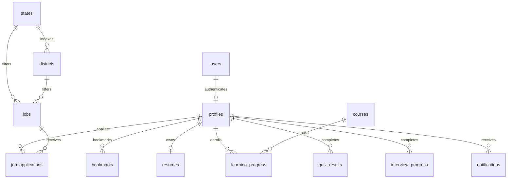

# System Architecture - EMPOWERRURAL

This document explains the technical layout, workspace dependencies, and relational database mapping of the EmpowerRural platform.

---

## 🏗️ Workspace Modules

We implement an npm workspaces monorepo structure. This allows native link resolution of local dependencies inside `node_modules`.

### 1. `@empowerrural/types`
* **Path:** `packages/types/`
* **Purpose:** Contains strict TypeScript interface declarations representing all core domain entities (UserProfile, Job, Course, Scheme, Application, Notification, ResumeData).
* **Usage:** Imported directly by both `apps/web` (frontend) and `apps/api` (backend) ensuring 100% type-safety across requests.

### 2. `@empowerrural/utils`
* **Path:** `packages/utils/`
* **Purpose:** Houses static variables like standard Indian states and districts lists, min/max qualification constants, date/currency formatters, and pagination calculators.

### 3. `@empowerrural/ui`
* **Path:** `packages/ui/`
* **Purpose:** A shared atomic UI library built on Tailwind CSS configurations. It exports custom branded buttons, soft shadowed rounded cards, inputs with validation states, modal overlays, badges, page loaders, and empty search templates.

---

## 💾 Database Relational Mapping

---

## 🛠️ Security Architecture

1. **Helmet Shielding:** Backend HTTP response headers are hardened against standard XSS and clickjacking scripts.
2. **CORS policies:** Restricted to developer origin networks.
3. **Zod payload validation:** Express routes check input schemas to prevent raw database injections.
4. **Row-Level Security (RLS):** Enabled on all PostgreSQL tables. Profiles can only edit their own columns, youth can only read listings, and admin roles gate management routines.
